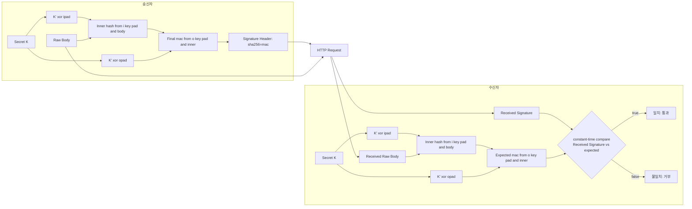

# HMAC 검증

HMAC 검증은 웹훅 보안의 기본입니다. 핵심은 아래 2가지를 확인하는 것입니다.

1. 인증: 이 요청이 정말 정상 발신자(예: GitHub/Bitbucket)에서 왔는가
2. 무결성: 전송 중 본문이 한 글자라도 바뀌지 않았는가

현재 코드에서도 같은 흐름을 사용합니다. 서명 헤더를 읽고, HMAC 계산 및 비교로 검증합니다.

## 무엇을 검증하나

수신측에서 검증에 필요한 입력값은 아래 3가지입니다.

1. 공유 비밀값 (Secret Key)
2. 원본 요청 본문 (Raw Body)
3. 요청 헤더의 서명값 (Signature Header, 예: sha256=...)

판정 기준은 간단합니다.

- 송신자가 보낸 서명값 signature와
- 수신자가 같은 Secret, 같은 Raw Body로 재계산한 expected가
- 상수 시간 비교에서 일치하면 통과, 아니면 거부합니다.

## 검증 흐름

검증은 "송신자 서명 생성"과 "수신자 재계산 비교"의 2단계로 진행됩니다.

1. 송신자(발신 시스템)
- Raw Body와 Secret으로 아래 값을 계산합니다.

$$
signature = HMAC_{SHA256}(secret, raw\_body)
$$

- 계산한 signature를 요청 헤더(예: sha256=<hex>)에 담아 전송합니다.

2. 수신자(검증 서버)
- 수신한 Raw Body를 그대로 사용해 아래 값을 다시 계산합니다.

$$
expected = HMAC_{SHA256}(secret, raw\_body)
$$

- 헤더의 signature와 expected를 상수 시간 비교로 대조합니다.
- 일치하면 통과, 다르면 거부합니다.

## HMAC과 SHA-256은 무엇인가

1. SHA-256
- SHA-256은 해시 함수입니다.
- 임의 길이 입력을 받아 고정 길이 256비트(32바이트) 해시값을 만듭니다.
- 같은 입력이면 항상 같은 출력이 나오며, 입력이 조금만 바뀌어도 결과가 크게 달라집니다.
- 다만 SHA-256만으로는 "누가 보냈는지"를 증명할 수 없습니다.

2. HMAC (Hash-based Message Authentication Code, 해시 기반 인증 코드)
- 암호화 해시 함수(SHA-256 등)와 비밀 키를 조합하여 메시지의 무결성과 인증을 보장하는 보안 알고리즘
- 해시 함수에 비밀키(Secret)를 결합해, 메시지 인증과 무결성 검증을 수행합니다.
- 즉, "메시지 + 비밀키"를 함께 사용해 서명을 만듭니다.
- 비밀키를 모르면 올바른 HMAC 값을 만들 수 없습니다.

## 둘의 관계(HMAC-SHA256)

1. 관계 요약
- HMAC은 구성 방식(알고리즘 틀)이고, SHA-256은 그 안에서 쓰는 해시 함수입니다.
- 따라서 HMAC-SHA256은 HMAC을 SHA-256으로 구현한 것을 의미합니다.

2. 왜 sha256=... 형태를 쓰나
- 헤더의 sha256= 접두사는 "이 서명이 SHA-256 기반 HMAC으로 계산되었다"는 알고리즘 힌트입니다.
- 서버는 같은 알고리즘(HMAC-SHA256), 같은 Secret, 같은 Raw Body로 다시 계산해 비교합니다.

3. 자주 헷갈리는 점
- SHA256(body)는 체크섬에 가깝고 인증 기능이 없습니다.
- HMAC-SHA256(secret, body)는 인증 + 무결성 검증을 제공합니다.
- SHA256(secret + body) 같은 임의 조합보다 표준 HMAC 구성을 사용해야 합니다.

4. HMAC-SHA256(secret, body)와 SHA256(secret + body)의 차이
- 공통점: 둘 다 Secret과 body를 입력으로 해시 값을 만듭니다.
- 차이점: HMAC은 키를 안전하게 다루도록 설계된 표준 구조(내부/외부 해시 2단계)를 사용합니다.
- 내부/외부 해시 2단계란 아래 흐름을 뜻합니다.
    1) inner = SHA256((K' xor ipad) || body)
    2) mac = SHA256((K' xor opad) || inner)
    여기서 K'는 블록 크기에 맞게 정규화한 키, ipad/opad는 고정 패딩 상수입니다.
- 핵심은 "키를 앞에 한 번 붙이는 방식"이 아니라, 키를 두 번 다른 형태로 섞어 해시한다는 점입니다.
- 이 구조 덕분에 단순 SHA256(secret + body) 대비 알려진 해시 조합 취약성에 더 강하고, 표준(RFC 2104)으로 오래 검증되었습니다.
- 실무에서는 이 수식을 직접 구현하기보다 언어 표준 라이브러리의 HMAC 구현을 그대로 사용하는 것이 안전합니다.
- SHA256(secret + body)는 단순 문자열 결합 후 해시하는 방식이라, 표준 인증 방식으로 권장되지 않습니다.
- HMAC은 다양한 공격 모델을 고려해 검증된 방식이며, 라이브러리로 일관되게 구현할 수 있습니다.



5. HMAC이 무엇인가(한 줄 정의)
- HMAC은 "비밀키를 이용해 메시지의 인증과 무결성을 검증"하기 위한 표준 메시지 인증 코드(MAC) 방식입니다.
- 즉, 단순 해시가 아니라 "같은 Secret을 아는 양측만 같은 결과를 만들 수 있게" 설계된 알고리즘 절차입니다.

## HMAC 검증 절차(송신자/수신자)

HMAC은 단순 해시 값 자체가 아니라, 송신자와 수신자가 같은 Secret을 공유하고 같은 계산 규칙으로 메시지를 검증하는 절차입니다.

1. 사전 준비(양측 공통)
- 송신자와 수신자는 같은 Secret을 안전하게 공유합니다.
- 사용할 알고리즘(예: HMAC-SHA256)과 서명 헤더 이름(예: X-Hub-Signature-256)을 합의합니다.

2. 송신자가 하는 일(서명 생성)
- 전송할 Raw Body 바이트를 확정합니다.
- Secret과 Raw Body로 HMAC-SHA256 값을 계산합니다.
- 계산한 값을 보통 `sha256=<hex>` 형태로 서명 헤더에 넣습니다.
- Raw Body와 서명 헤더를 함께 전송합니다.

3. 수신자가 하는 일(서명 검증)
- 요청에서 Raw Body를 그대로 읽습니다.
- 헤더에서 서명값을 추출하고 형식을 검사합니다.
- 서버에 저장된 같은 Secret으로 expected = HMAC-SHA256(secret, raw_body)를 다시 계산합니다.
- 헤더 서명과 expected를 상수 시간 비교로 대조합니다.
- 일치하면 통과, 불일치하면 거부합니다.

4. 왜 Raw Body 그대로가 중요한가
- JSON 파싱 후 재직렬화, 공백/개행 변화, 인코딩 변화가 생기면 바이트 단위가 달라집니다.
- HMAC은 바이트가 하나만 달라도 결과가 달라지므로, 반드시 원문 바이트 그대로 계산해야 합니다.

5. 절차 요약
- 송신자: Secret으로 body 서명 생성 후 header에 담아 전송
- 수신자: 같은 Secret으로 재계산 후 상수 시간 비교
- 이 과정을 통해 인증(발신자 진위)과 무결성(변조 여부)을 함께 확인합니다.

## 자주 묻는 질문(FAQ)

1. HMAC은 수신자가 비밀키와 body를 다시 hash해서 request 메시지를 검증하는 것인가?
- 네, 개념적으로 맞습니다.
- 수신자는 Raw Body 그대로와 동일한 Secret으로 HMAC-SHA256 값을 다시 계산합니다.
- 그리고 요청 헤더의 서명값과 상수 시간 비교(hmac.Equal 등)로 대조합니다.
- 값이 같으면 인증(Secret을 아는 발신자 가능성)과 무결성(전송 중 변조 없음)을 확인한 것으로 봅니다.

2. 주의할 점
- 단순 hash(SHA256(body)) 검증과 HMAC 검증은 다릅니다.
- HMAC은 Secret을 포함하므로 인증 성질이 생깁니다.
- 다만 HMAC만으로 재전송(Replay) 공격은 막지 못하므로 delivery id, timestamp, nonce 같은 추가 검증이 필요합니다.

## HMAC 검증 목적

1. 인증(Authentication): Secret을 아는 쪽만 올바른 서명을 만들 수 있으므로 발신자 진위를 확인합니다.
2. 무결성(Integrity): 바디가 변조되면 HMAC이 달라져 즉시 탐지할 수 있습니다.
3. 신뢰 경계 확립: 내부 후속 로직(큐 적재, 빌드 트리거 등)을 안전한 입력에만 수행합니다.

## 방어 가능한 공격

1. 위조 웹훅 전송
- 공격자가 임의 JSON을 보내도 Secret이 없으면 유효 서명을 만들 수 없습니다.

2. 전송 중 페이로드 변조(MITM 변조)
- 프록시/중간자/네트워크 경로에서 body가 바뀌면 서명 불일치로 차단됩니다.

3. 단순 페이로드 오염/인코딩 변형
- 원문 바이트가 달라지면 실패하므로 데이터 손상을 탐지할 수 있습니다.

4. 타이밍 기반 비교 공격(부분)
- 상수 시간 비교를 쓰면 서명 문자열 비교 시 정보 누설 가능성을 줄일 수 있습니다.
- 현재 코드의 hmac.Equal 사용은 이 점에서 올바른 방향입니다.

## 방어하지 못하는 것

1. 재전송 공격(Replay)
- 재전송 자체는 과거의 유효한 메시지를 다시 보내는 행위이고, 서버가 이를 새로운 요청으로 오인해 승인되지 않은 중복 효과를 발생시키거나 그 시도가 이루어질 때 재전송 공격으로 간주합니다.
- 캡처한 정상 요청을 그대로 다시 보내면 서명은 여전히 유효할 수 있습니다.
- HMAC 검증은 "변조되지 않았는가"는 확인하지만, "지금 막 생성된 새 요청인가"는 보장하지 않습니다.
- 따라서 공격자가 과거의 정상 요청 전체(body + signature header)를 그대로 다시 보내면, 서버가 이를 새로운 요청으로 오인하는 순간 공격이 됩니다.
- 예를 들어 결제 승인, 송금, 포인트 차감, 빌드 트리거 같은 요청은 같은 메시지가 한 번 더 처리되는 것만으로도 실제 피해가 발생할 수 있습니다.
- 즉 재전송 자체는 단순 복제이지만, 서버가 중복 여부나 신선도(freshness)를 검증하지 않으면 그 복제가 곧 중복 실행 공격으로 전환됩니다.
- 전형적인 흐름은 아래와 같습니다.
    1) 정상 사용자가 유효한 요청을 전송함
    2) 공격자가 그 요청의 Raw Body와 서명 헤더를 캡처함
    3) 공격자가 같은 요청을 나중에 그대로 다시 전송함
    4) 서버가 nonce, timestamp, sequence, delivery id 중복 검사를 하지 않으면 새 요청으로 처리함
- 대응: delivery id 중복 차단, timestamp 윈도우 검사, nonce 저장, sequence number 검증, idempotency key 적용

2. Secret 유출
- Secret이 탈취되면 공격자도 정상 서명을 만들 수 있습니다.
- 대응: Secret 로테이션, 안전 저장, 최소 권한

3. 대용량/고빈도 DoS
- 서명 검증 자체가 트래픽 폭주를 막지는 못합니다.
- 대응: rate limit, IP allowlist, 큐 백프레셔, WAF

4. 발신자 시스템 자체가 침해된 경우
- 공격자가 발신 시스템 권한을 가진 경우는 별도 신뢰 문제입니다.

## 실무 체크리스트

1. 반드시 Raw Body 그대로 HMAC 계산
2. JSON 파싱/정규화 전에 검증
3. 헤더 포맷 검사(예: sha256= 접두사, 알고리즘 파싱)
4. 상수 시간 비교 사용
5. 실패 사유는 로그에 남기되 Secret/원문 민감정보는 마스킹
6. 재전송 방지 로직 추가(특히 production)
7. Secret 주기적 교체

## Secret Key 생성 방법

### 1. 생성 원칙

Secret Key는 다음 조건을 만족해야 합니다:

1. **암호화 안전한 난수 생성기 사용**
   - 표준 라이브러리의 `SecureRandom`, `crypto.random`, `secrets` 등 사용
   - 일반 난수 생성기(Math.random, rand 등)는 절대 금지
   - 이유: 예측 불가능해야 공격자가 Secret을 추측할 수 없음

2. **최소 길이**
   - HMAC-SHA256의 경우 32바이트(256비트) 이상 권장
   - 키가 짧을수록 brute-force 공격에 취약
   - 실제로는 64바이트(512비트) 정도면 충분히 안전

3. **생성 후 처리**
   - Base64 또는 Hex 인코딩하여 저장/전달
   - 평문 바이너리로 그대로 다루지 않음
   - 매번 새로운 Secret을 생성해야 함(절대 재사용 금지)

### 2. 언어별 생성 예제

**Java**
```java
import java.security.SecureRandom;
import java.util.Base64;

// 32바이트(256비트) Secret 생성
SecureRandom sr = new SecureRandom();
byte[] secretBytes = new byte[32];
sr.nextBytes(secretBytes);
String secret = Base64.getEncoder().encodeToString(secretBytes);
System.out.println("Secret: " + secret);
```

**Go**
```go
import (
    "crypto/rand"
    "encoding/base64"
    "fmt"
)

// 32바이트 Secret 생성
secret := make([]byte, 32)
if _, err := rand.Read(secret); err != nil {
    panic(err)
}
encoded := base64.StdEncoding.EncodeToString(secret)
fmt.Println("Secret:", encoded)
```

### 3. CLI 도구로 생성

명령줄에서도 간단히 생성 가능:

```bash
# Base64 인코딩된 32바이트 Secret 생성
openssl rand -base64 32

# 또는 hex 형식으로 생성
openssl rand -hex 32
```

## Secret Key 공유 및 저장 방법

### 1. 안전한 공유 절차

**절차 원칙:**
- Secret을 평문으로 이메일, 메신저, 문서에 올려놓지 않기
- Out-of-band(채널 분리) 방식 사용
- 공유 후 로그/기록 삭제
- 송수신자만 알도록 (제3자 노출 금지)

**권장 공유 방법:**

1. **1회용 비밀 공유 서비스**
   - Bitwarden Send (자동 삭제 지원)
   - Privnote, OneTimeSecret 등 단회용 링크
   - 특징: 일정 시간/조회 후 자동 삭제
   - 장점: 기록 남지 않음

2. **암호화된 메시지**
   - PGP/GPG 암호화 메일
   - Signal, Wire 같은 E2E 암호화 메신저
   - 특징: 메시지는 암호화되고 발신자/수신자만 열 수 있음

3. **보안 채널(조직 내부)**
   - 사내 비밀 저장소(Vault, AWS Secrets Manager)
   - HashiCorp Consul/Nomad의 Secret 엔드포인트
   - Kubernetes Secret (RBAC와 함께 사용)
   - 특징: 접근 제어, 감사 로그 남음

4. **직접 만남(초기 설정)**
   - 신원 확인 후 면대면으로 전달
   - QR 코드 스캔 또는 USB로 전달
   - 가장 안전하지만 실무에는 비실용적

### 2. 저장 방법(수신자 시스템)

공유받은 Secret을 어디에 어떻게 저장할지:

**절대 금지:**
```
❌ 코드에 하드코딩 (버전 관리 노출)
❌ 평문 설정 파일 (리포지토리 커밋)
❌ 파일명에 .txt, .conf 같은 확장자로 저장
❌ 로그 파일에 출력
```

**권장 방법:**

1. **환경 변수**
   ```bash
   # .env 파일 (로컬 개발용, .gitignore에 등록)
   export WEBHOOK_SECRET=<base64-encoded-secret>
   
   # 실행 시
   source .env
   java -jar app.jar
   ```
   ```java
   // Java 코드에서 읽기
   String secret = System.getenv("WEBHOOK_SECRET");
   if (secret == null) {
       throw new IllegalStateException("WEBHOOK_SECRET not set");
   }
   ```

2. **설정 관리 도구 (권장)**
   ```yaml
   # application.yml (프로덕션)
   # 이 파일은 배포 시에만 배포 엔진에서 주입됨
   webhook:
     secret: ${WEBHOOK_SECRET}  # 환경 변수에서 읽음
   ```
   
   Spring Boot의 경우:
   ```java
   @Configuration
   public class WebhookConfig {
       @Value("${webhook.secret}")
       private String secret;
       
       @Bean
       public HmacValidator hmacValidator() {
           return new HmacValidator(secret);
       }
   }
   ```

3. **시크릿 관리 서비스 (엔터프라이즈)**
   
   AWS Secrets Manager:
   ```java
   SecretsManagerClient client = SecretsManagerClient.builder()
       .region(Region.US_EAST_1)
       .build();
   
   GetSecretValueRequest request = GetSecretValueRequest.builder()
       .secretId("webhook-secret")
       .build();
   
   GetSecretValueResponse response = client.getSecretValue(request);
   String secret = response.secretString();
   ```
   
   HashiCorp Vault:
   ```java
   VaultTemplate vault = new VaultTemplate(
       new RestTemplateFactory().restTemplate()
   );
   VaultResponse response = vault.read("secret/webhook");
   String secret = (String) response.getData().get("secret");
   ```

4. **Kubernetes Secret**
   ```yaml
   apiVersion: v1
   kind: Secret
   metadata:
     name: webhook-secret
   type: Opaque
   data:
     secret: <base64-encoded-value>
   ```
   
   Pod에서 마운트:
   ```yaml
   spec:
     containers:
     - name: app
       env:
       - name: WEBHOOK_SECRET
         valueFrom:
           secretKeyRef:
             name: webhook-secret
             key: secret
   ```

### 3. 공유 후 관리

**수신자가 Secret을 받은 후:**

1. 즉시 저장소(환경 변수, 시크릿 관리 도구)에 저장
2. 임시 메시지/이메일은 삭제
3. 저장 완료를 송신자에게 알림
4. 테스트 웹훅으로 검증 (Secret이 정상 작동하는지 확인)

**송신자가 Secret을 전달한 후:**

1. 공유 채널(메시지, 링크)에서 제거
2. 수신자 확인 후 기록 삭제
3. 필요시 Secret 저장 현황 확인

### 4. Secret Rotation (주기적 교체)

단일 Secret 수명:
- 개발/테스트: 변경 불필요 (로컬용)
- 프로덕션: **90일마다 교체 권장** (업계 표준)
- 보안 사고 발생 시: 즉시 교체

Rotation 절차:

1. **새 Secret 생성**
   ```
   - 이전: secret_old = "..."
   - 새로: secret_new = "..."
   ```

2. **양측 모두 새 Secret 저장**
   - 송신자와 수신자가 동시에 secret_new를 설정
   - 동시가 아니면 한쪽이 준비될 때까지 대기

3. **이중 검증 기간 운영 (권장)**
   - 수신자가 new/old 모두 검증하는 기간을 며칠 운영
   - 이유: 양측 동기화 오류 시 웹훅 손실 방지
   
   ```java
   public boolean validateSignature(String signature, byte[] body) {
       // 새 Secret으로 먼저 시도
       if (isValidSignature(signature, body, currentSecret)) {
           return true;
       }
       // 실패하면 이전 Secret으로 시도 (Rotation 기간용)
       if (isValidSignature(signature, body, previousSecret)) {
           logger.warn("Using previous secret - please update client");
           return true;
       }
       return false;
   }
   ```

4. **이전 Secret 폐기**
   - 안정화 확인 후 old secret 삭제
   - 재설정 불가능하도록 보관 금지

## 완전한 공유 체크리스트

- [ ] Secret 생성: 암호화 안전한 난수, 32바이트 이상
- [ ] Secret 인코딩: Base64 또는 Hex 형식
- [ ] 송신자 저장: 환경 변수 또는 시크릿 관리 도구
- [ ] 공유 채널: Out-of-band 방식 (1회용 비밀 공유, 암호화 메시지 등)
- [ ] 수신자 저장: 환경 변수 또는 시크릿 관리 도구 (코드에 하드코딩 금지)
- [ ] 테스트: 공유 후 테스트 웹훅으로 검증
- [ ] 로그 확인: Secret이 로그에 남지 않았는지 확인
- [ ] Rotation 계획: 90일 주기 교체 방안 수립
- [ ] 문서화: Secret 저장 위치, 담당자, 교체 일정 기록