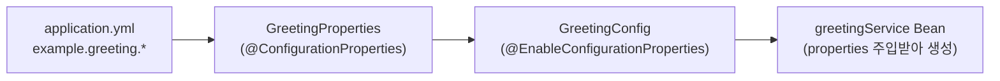

# Spring Property → Bean 바인딩 간단 예제

`AwsSdkConfig`의 `AwsS3Properties`처럼, `application.yml`(또는 `.properties`)의 값을
`@ConfigurationProperties`로 자바 객체에 바인딩하고, 그 객체를 다시 `@Bean` 생성에
활용하는 패턴을 최소 예제로 정리한다.

## 1. application.yml

```yaml
example:
  greeting:
    prefix: "Hello"
    target: "World"
```

## 2. Property를 담을 record 정의

`@ConfigurationProperties`는 `prefix`로 지정한 하위 경로의 값을 필드(record면 생성자
파라미터)에 이름 기준으로 매핑한다.

```java
@ConfigurationProperties(prefix = "example.greeting")
public record GreetingProperties(
    String prefix,
    String target
) {}
```

## 3. Configuration 클래스에서 활성화 + Bean 등록

```java
@Configuration
@EnableConfigurationProperties(GreetingConfig.GreetingProperties.class)
public class GreetingConfig {

    // record to bind at `example.greeting` property
    @ConfigurationProperties(prefix = "example.greeting")
    public record GreetingProperties(String prefix, String target) {}

    // register bean using GreetingProperties
    @Bean
    public GreetingService greetingService(GreetingProperties properties) {
        return new GreetingService(properties.prefix(), properties.target());
    }
}
```

- `@EnableConfigurationProperties(GreetingProperties.class)`: `GreetingProperties`를
  스프링 컨테이너에 Bean으로 등록하고, yml 값을 바인딩하도록 활성화한다.
- `greetingService(GreetingProperties properties)`: 위에서 바인딩된 `GreetingProperties`
  Bean을 파라미터로 주입받아, 실제 사용할 Bean(`GreetingService`)을 생성할 때 값을 꺼내
  쓴다.

## 4. 사용할 서비스 클래스

```java
public class GreetingService {

    private final String prefix;
    private final String target;

    public GreetingService(String prefix, String target) {
        this.prefix = prefix;
        this.target = target;
    }

    public String greet() {
        return prefix + ", " + target + "!";
    }
}
```

## 흐름 요약



`AwsSdkConfig`에서 `AwsS3Properties`가 `ceph.rgw.*` 값을 바인딩하고, 이를 각 `S3Client`,
`S3AsyncClient` 등의 `@Bean` 메서드가 파라미터로 받아 사용하는 구조와 동일한 패턴이다.
